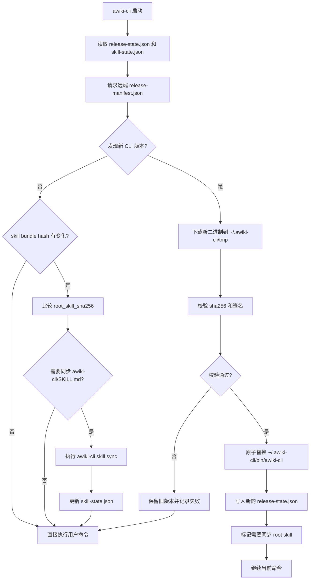
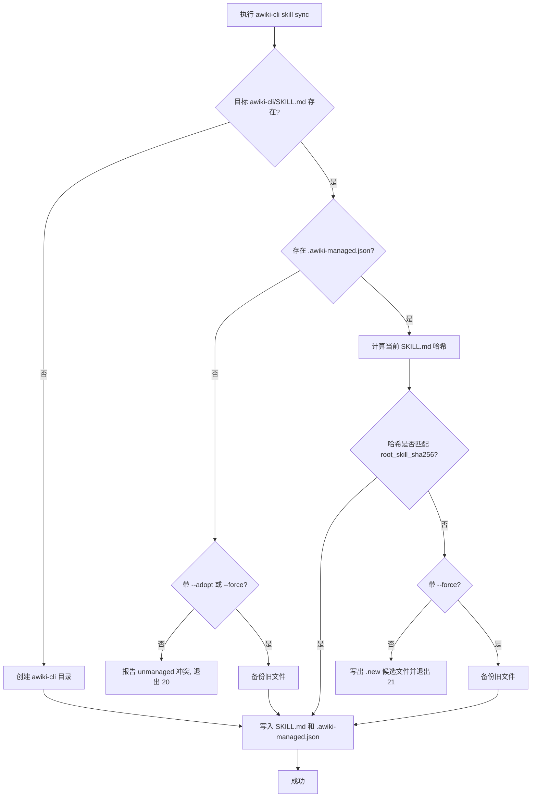

下面是整理后的 **awiki-cli skill 更新机制最终方案 v1.0**。
我按上一版的结构完整收敛，并已经纳入你刚才的修改要求：

* 命令名统一为 **`awiki-cli`**
* 对外只暴露 **一个 skill：`awiki-cli/`**
* 本地公开文件为 **`awiki-cli/SKILL.md`**
* 更深入的命令文档、reference 文档、workflow 文档，全部通过 **`awiki-cli` 动态读取**
* 不再存在 `awiki-loader`
* 不再对外暴露多个子 skill

---

# 1. 设计目标

## 1.1 核心目标

1. **CLI 自更新与 skill 文档保持严格一致**
   `SKILL.md` 与更深层文档都以当前 `awiki-cli` 版本为准，不再维护独立的 skill 发布链路。

2. **对外只暴露一个 skill**
   公开入口统一为：

   ```text
   ~/.agents/skills/awiki-cli/SKILL.md
   ```

   这个 skill 只承担：

   * 元数据入口
   * 文档索引入口
   * deeper docs 的读取协议说明

3. **更深文档由 CLI 动态提供**
   命令说明、认证、安全、workflow、schema 引导不常驻预装，而是通过 `awiki-cli` 在运行时读取。

4. **自动升级只同步 root skill**
   自动更新范围仅限：

   ```text
   awiki-cli/SKILL.md
   ```

   deeper docs 不自动落地常驻。

5. **兼容在线与离线场景**
   默认动态读取；需要离线时，通过 `awiki-cli skill export` 导出完整 skill 包。

---

## 1.2 设计原则

### 原则 1：单入口

对外只有一个 skill，避免 skill 命名空间膨胀、版本漂移、宿主 prompt 污染。

### 原则 2：CLI 为唯一真源

所有 skill 元数据、子文档索引、command 文档、reference 文档、workflow 文档，都以内置于 `awiki-cli` 的 bundle 为准。

### 原则 3：动态读取优先

默认不把完整文档树铺到本地公开 skill 目录，只在需要时读取对应节点。

### 原则 4：最小自动覆盖

自动同步只覆盖 awiki-cli 自己管理的 root `SKILL.md`；用户自行修改的文件不默认覆盖。

### 原则 5：版本化缓存

动态读取出的 deeper docs 按 `cli_version + doc_path` 缓存，便于回滚、排障、导出。

### 原则 6：路径显式、结构清晰

内部文档命名空间固定为：

```text
commands/
references/
workflows/
```

必要时可增加 `indexes/` 或 `schemas/` 的索引，但 schema 本身优先通过命令查询。

---

# 2. 总体架构

```text
远端:
  release-manifest.json           # CLI 自更新清单
  awiki-cli-<os>-<arch>.tar.gz    # 二进制发布包

CLI 内置:
  internal/skill/manifest.json
  internal/skill/root.SKILL.md.tmpl
  internal/skill/commands/**
  internal/skill/references/**
  internal/skill/workflows/**

本地常驻公开 skill:
  ~/.agents/skills/awiki-cli/SKILL.md
  ~/.agents/skills/awiki-cli/.awiki-managed.json

本地状态与缓存:
  ~/.awiki-cli/state/release-state.json
  ~/.awiki-cli/state/skill-state.json
  ~/.awiki-cli/cache/skill/<cli-version>/**
```

---

# 3. 目录结构

## 3.1 仓库内部目录

```text
awiki-cli/
├─ cmd/
├─ internal/
│  ├─ updater/
│  │  ├─ release_manifest.go
│  │  └─ apply_update.go
│  ├─ skill/
│  │  ├─ manifest.json
│  │  ├─ root.SKILL.md.tmpl
│  │  ├─ commands/
│  │  │  ├─ message/
│  │  │  │  ├─ send.md
│  │  │  │  └─ reply.md
│  │  │  ├─ group/
│  │  │  │  ├─ create.md
│  │  │  │  └─ add-member.md
│  │  │  └─ file/
│  │  │     ├─ upload.md
│  │  │     └─ publish.md
│  │  ├─ references/
│  │  │  ├─ install.md
│  │  │  ├─ auth.md
│  │  │  ├─ safety.md
│  │  │  └─ troubleshooting.md
│  │  ├─ workflows/
│  │  │  ├─ send-notification.md
│  │  │  └─ publish-file.md
│  │  └─ indexes/
│  │     ├─ categories.json
│  │     └─ aliases.json
│  └─ render/
│     ├─ root_skill_renderer.go
│     └─ doc_renderer.go
├─ docs/
└─ scripts/
```

---

## 3.2 用户机器上的运行目录

```text
~/.awiki-cli/
├─ versions/
│  ├─ 1.8.0/awiki-cli
│  └─ 1.8.1/awiki-cli
├─ bin/
│  └─ awiki-cli -> ../versions/1.8.1/awiki-cli
├─ state/
│  ├─ release-state.json
│  └─ skill-state.json
├─ cache/
│  └─ skill/
│     └─ 1.8.1/
│        ├─ root/
│        │  └─ SKILL.md
│        ├─ commands/
│        │  ├─ message/send.md
│        │  └─ group/create.md
│        ├─ references/
│        │  └─ auth.md
│        └─ workflows/
│           └─ publish-file.md
└─ tmp/
```

---

## 3.3 对外公开的唯一 skill 目录

```text
~/.agents/skills/awiki-cli/
├─ SKILL.md
└─ .awiki-managed.json
```

说明：

* 这里只放 **唯一公开 root skill**
* 不再创建 `awiki-loader/`
* 不再创建 `awiki-message/`、`awiki-group/`、`awiki-file/` 等公开子 skill 目录

---

# 4. Manifest 格式

本方案使用三层 manifest：

1. 远端 release manifest
2. CLI 内置 skill manifest
3. 本地受管文件 manifest

---

## 4.1 远端 release manifest

用途：CLI 启动时检查更新，并声明当前 skill bundle 的版本信息。

`release-manifest.json`

```json
{
  "schema_version": 1,
  "channel": "stable",
  "latest": "1.8.1",
  "published_at": "2026-04-17T08:30:00Z",
  "artifacts": {
    "darwin-arm64": {
      "url": "https://downloads.example.com/awiki-cli/1.8.1/awiki-cli-darwin-arm64.tar.gz",
      "sha256": "f7a0d8d6b1c4...",
      "size": 18432012,
      "signature": "minisign:RWQ..."
    },
    "linux-amd64": {
      "url": "https://downloads.example.com/awiki-cli/1.8.1/awiki-cli-linux-amd64.tar.gz",
      "sha256": "9ac2e2aa91f9...",
      "size": 19102311,
      "signature": "minisign:RWQ..."
    }
  },
  "skill_bundle": {
    "bundle_version": "2026.04.17",
    "bundle_sha256": "4d8f9c3b...",
    "root_skill_sha256": "673ac2..."
  }
}
```

字段约定：

* `latest`：远端最新 CLI 版本
* `artifacts`：各平台二进制包
* `skill_bundle.bundle_version`：skill bundle 逻辑版本
* `skill_bundle.bundle_sha256`：整包哈希
* `skill_bundle.root_skill_sha256`：唯一公开 root skill 的渲染模板哈希

---

## 4.2 CLI 内置 skill manifest

`internal/skill/manifest.json`

```json
{
  "schema_version": 1,
  "cli_version": "1.8.1",
  "bundle_version": "2026.04.17",
  "generated_at": "2026-04-17T08:20:00Z",

  "root_skill": {
    "name": "awiki-cli",
    "template": "root.SKILL.md.tmpl",
    "sha256": "673ac2...",
    "description": "Single public awiki-cli skill. It exposes metadata, internal doc indexes, and the protocol for loading deeper awiki-cli docs dynamically."
  },

  "metadata": {
    "default_doc_namespace": "commands",
    "default_schema_lookup": "awiki-cli schema",
    "supports_export": true
  },

  "children": [
    {
      "path": "commands/message/send.md",
      "kind": "command",
      "title": "message.send",
      "summary": "发送消息的命令说明与使用约束",
      "sha256": "11aa22...",
      "schema": "message.send",
      "tags": ["message", "send", "write"]
    },
    {
      "path": "commands/message/reply.md",
      "kind": "command",
      "title": "message.reply",
      "summary": "回复消息的命令说明与上下文约束",
      "sha256": "22bb33...",
      "schema": "message.reply",
      "tags": ["message", "reply", "write"]
    },
    {
      "path": "commands/group/create.md",
      "kind": "command",
      "title": "group.create",
      "summary": "创建群组的命令说明",
      "sha256": "33cc44...",
      "schema": "group.create",
      "tags": ["group", "create", "write"]
    },
    {
      "path": "references/auth.md",
      "kind": "reference",
      "title": "认证与权限",
      "summary": "登录、鉴权、身份切换与权限不足处理",
      "sha256": "44dd55...",
      "tags": ["auth", "permission"]
    },
    {
      "path": "references/safety.md",
      "kind": "reference",
      "title": "安全与确认规则",
      "summary": "写操作、发布、删除前的确认规则",
      "sha256": "55ee66...",
      "tags": ["safety", "confirmation"]
    },
    {
      "path": "workflows/publish-file.md",
      "kind": "workflow",
      "title": "文件发布流程",
      "summary": "从上传到发布的推荐执行路径",
      "sha256": "66ff77...",
      "tags": ["file", "publish", "workflow"]
    }
  ]
}
```

说明：

* `root_skill`：唯一公开 skill 元信息
* `children`：更深层文档节点索引
* `kind` 固定为：

  * `command`
  * `reference`
  * `workflow`

---

## 4.3 本地受管文件 manifest

`~/.agents/skills/awiki-cli/.awiki-managed.json`

```json
{
  "schema_version": 1,
  "type": "root-skill",
  "skill_name": "awiki-cli",
  "cli_version": "1.8.1",
  "bundle_version": "2026.04.17",
  "root_skill_sha256": "673ac2...",
  "installed_at": "2026-04-17T08:35:12Z",
  "managed_paths": ["SKILL.md"],
  "adopted": false
}
```

规则：

* 有这个文件，且 `SKILL.md` 当前哈希匹配 `root_skill_sha256` → 可自动覆盖
* 有这个文件，但 `SKILL.md` 内容变了 → 视为用户改动，触发冲突
* 没有这个文件 → 视为非受管 skill，不自动覆盖

---

# 5. 状态文件格式

## 5.1 `release-state.json`

```json
{
  "schema_version": 1,
  "current_version": "1.8.1",
  "last_checked_at": "2026-04-17T09:00:00Z",
  "channel": "stable",
  "pending_restart": false,
  "current_artifact_sha256": "f7a0d8d6b1c4..."
}
```

---

## 5.2 `skill-state.json`

```json
{
  "schema_version": 1,
  "current_cli_version": "1.8.1",
  "current_bundle_version": "2026.04.17",
  "current_bundle_sha256": "4d8f9c3b...",
  "root_skill_sync": {
    "dir": "~/.agents/skills",
    "root_skill_sha256": "673ac2...",
    "last_synced_at": "2026-04-17T09:01:20Z"
  },
  "cache_policy": {
    "keep_versions": ["1.8.1", "1.8.0"],
    "ttl_days": 30
  }
}
```

---

# 6. 命令定义

本方案统一使用 `awiki-cli skill ...` 命名空间。

---

## 6.1 `awiki-cli skill index`

```bash
awiki-cli skill index [--json] [--kind command|reference|workflow] [--tag <tag>]
```

### 作用

输出唯一公开 skill `awiki-cli` 的元数据，以及内部文档节点索引。

### 示例输出

```json
{
  "name": "awiki-cli",
  "cli_version": "1.8.1",
  "bundle_version": "2026.04.17",
  "children": [
    {
      "path": "commands/message/send.md",
      "kind": "command",
      "title": "message.send",
      "summary": "发送消息的命令说明与使用约束"
    },
    {
      "path": "references/auth.md",
      "kind": "reference",
      "title": "认证与权限",
      "summary": "登录、鉴权、身份切换与权限不足处理"
    }
  ]
}
```

### 退出码

* `0`：成功
* `2`：skill bundle 不可用
* `3`：过滤参数非法

---

## 6.2 `awiki-cli skill get`

```bash
awiki-cli skill get <path> [--format markdown|json] [--write <file>] [--cache auto|refresh|bypass]
```

例如：

```bash
awiki-cli skill get commands/message/send.md
awiki-cli skill get references/auth.md
awiki-cli skill get workflows/publish-file.md
```

### 作用

读取内部文档节点。
`<path>` 不是 skill name，而是内部文档路径。

### 支持的路径命名空间

```text
commands/**
references/**
workflows/**
```

### 行为

* 默认输出 markdown 到 stdout
* 支持写入文件
* 支持读取缓存
* 只允许访问 manifest 声明过的路径，拒绝任意路径穿透

### JSON 输出示例

```json
{
  "path": "commands/message/send.md",
  "kind": "command",
  "cli_version": "1.8.1",
  "bundle_version": "2026.04.17",
  "sha256": "11aa22...",
  "content": "# message.send\n..."
}
```

### 退出码

* `0`：成功
* `2`：找不到路径
* `4`：路径不在 manifest 中
* `5`：渲染失败

---

## 6.3 `awiki-cli skill sync`

```bash
awiki-cli skill sync [--dir <skill-root>] [--dry-run] [--force] [--adopt] [--json]
```

### 作用

同步唯一公开 root skill：

```text
<dir>/awiki-cli/SKILL.md
<dir>/awiki-cli/.awiki-managed.json
```

默认 `dir`：

```text
~/.agents/skills
```

### 写入规则

* 目标不存在 → 创建
* 目标存在且为 awiki-cli 受管文件、内容未被修改 → 自动覆盖
* 目标存在且为 awiki-cli 受管文件、内容已被修改 → 冲突
* 目标存在但不是受管文件 → 默认不覆盖
* `--adopt`：接管已有文件，先备份后写入
* `--force`：无条件覆盖，但仍先备份

### 备份路径

```text
<dir>/awiki-cli/.backup/SKILL.md.<timestamp>.bak
```

### 退出码

* `0`：成功
* `20`：非受管冲突
* `21`：受管但已被用户修改
* `22`：目录不可写

---

## 6.4 `awiki-cli skill export`

```bash
awiki-cli skill export [--dir <output-dir>] [--all] [--path <doc-path>] [--include-root] [--clean] [--json]
```

### 作用

导出离线 skill 包。

### 使用方式

导出完整包：

```bash
awiki-cli skill export --dir ./out --all --include-root
```

只导出某个内部文档：

```bash
awiki-cli skill export --dir ./out --path commands/message/send.md --include-root
```

### 导出结构

```text
out/
├─ skill-manifest.json
└─ awiki-cli/
   ├─ SKILL.md
   ├─ commands/
   │  ├─ message/send.md
   │  └─ group/create.md
   ├─ references/
   │  ├─ auth.md
   │  └─ safety.md
   └─ workflows/
      └─ publish-file.md
```

### 退出码

* `0`：成功
* `2`：找不到路径
* `23`：输出目录非空且未指定 `--clean`
* `22`：输出目录不可写

---

## 6.5 `awiki-cli schema`

```bash
awiki-cli schema <resource>.<method>
```

例如：

```bash
awiki-cli schema message.send
awiki-cli schema group.create
```

### 作用

运行时查询字段结构、参数形状、可选项约束。
skill 根文档和内部文档只负责：

* 何时用
* 怎么用
* 风险是什么
* 推荐的执行和验证路径

具体参数结构始终以 `schema` 输出为准。

---

# 7. 渲染与读取规则

## 7.1 root skill 渲染规则

`sawiki-cli/SKILL.md` 的渲染顺序：

1. 读取 `internal/skill/manifest.json`
2. 读取 `root.SKILL.md.tmpl`
3. 注入：

   * CLI 版本
   * bundle 版本
   * 文档入口命令
   * schema 查询命令
4. 生成 root `SKILL.md`
5. 计算哈希
6. 同步到本地公开 skill 目录

---

## 7.2 内部文档读取规则

`awiki-cli skill get <path>` 的处理顺序：

1. 读取 `manifest.json`
2. 校验 `<path>` 在 `children` 中存在
3. 根据 path 读取对应内置文件
4. 渲染必要变量
5. 计算输出哈希
6. 写入版本化缓存
7. 返回 stdout 或文件

---

## 7.3 缓存规则

缓存 key：

```text
<cli-version>/<path>
```

例如：

```text
~/.awiki-cli/cache/skill/1.8.1/commands/message/send.md
~/.awiki-cli/cache/skill/1.8.1/references/auth.md
```

### 缓存策略

* `auto`：优先命中缓存，bundle hash 不一致则失效
* `refresh`：强制重渲染并更新缓存
* `bypass`：不读写缓存

---

# 8. root `SKILL.md` 模板

落地文件：

```text
~/.agents/skills/awiki-cli/SKILL.md
```

模板如下：

```md
---
name: awiki-cli
description: Use this skill for any task that may involve awiki-cli. This is the single public awiki-cli skill. It exposes skill metadata, internal command-doc indexes, and the protocol for loading deeper awiki-cli docs dynamically.
compatibility: Requires awiki-cli on PATH.
metadata: {"entrypoint":"awiki-cli skill index","doc_get":"awiki-cli skill get <path>","schema_get":"awiki-cli schema <resource>.<method>"}
---

# awiki-cli

## Purpose

This is the only public awiki-cli skill.

Do not assume this file contains all command details.
Use it as:
1. metadata
2. index of deeper command/reference/workflow docs
3. routing instructions for loading the next document

## Activation protocol

1. Run `awiki-cli skill index --json`
2. Find the most relevant internal doc path
3. Load that doc with `awiki-cli skill get <path>`
4. If parameter structure is uncertain, run:
   `awiki-cli schema <resource>.<method>`

## Internal document kinds

- `commands/...`
  Command-specific usage, preconditions, examples, risk points, and verification steps.

- `references/...`
  Shared guidance such as install, auth, permission handling, safety, and troubleshooting.

- `workflows/...`
  Multi-step procedures that combine several commands.

## Routing hints

- Install, version mismatch, login, auth, permission issues
  → `references/install.md`, `references/auth.md`, `references/troubleshooting.md`

- Sending or replying to messages
  → `commands/message/send.md`, `commands/message/reply.md`

- Group creation or member management
  → `commands/group/create.md`, `commands/group/add-member.md`

- File upload or publish
  → `commands/file/upload.md`, `commands/file/publish.md`

- Higher-level multi-step operation
  → check `workflows/...`

## Rules

- Before any write, send, publish, delete, or destructive action, load the relevant command doc first.
- If a command doc refers to a shared rule, load the referenced file under `references/...`.
- Never guess the field schema. Query `awiki-cli schema ...` when unsure.
- If `awiki-cli` is missing or outdated, stop and surface the installation or upgrade instructions.

## Notes

The root skill may be auto-synced by awiki-cli after CLI upgrade.
Deeper docs are versioned with the CLI and should be loaded via awiki-cli itself.
```

---

# 9. 更新流程图

## 9.1 CLI 启动与 root skill 同步流程



---

# 10. 冲突处理流程图

## 10.1 root skill 冲突处理



---

# 11. 关键实现细节

## 11.1 为什么只暴露一个公开 skill

因为你当前的目标不是让 skill 本身成为功能树，而是让 `awiki-cli` 作为统一入口。
这样做的直接收益：

* 外部 skill 数量恒定
* 宿主 prompt 中 skill catalog 更干净
* 版本同步关系更简单
* 自动升级只处理一个公开文件

---

## 11.2 为什么 deeper docs 不默认落地

因为它们和 CLI 版本强绑定，并且可能持续细分。
如果全部预装到公开 skill 目录，会带来几个问题：

* 文档数量膨胀
* 升级覆盖逻辑更复杂
* 用户本地 patch 更难管理
* 宿主侧更容易出现旧文档残留

所以默认策略是：

* 运行时动态读取
* 按版本缓存
* 离线时显式导出

---

## 11.3 为什么 `skill get` 用 path 而不是 skill name

因为现在已经不再有多个公开 skill。
功能单元从“skill”收敛成“文档路径节点”。

也就是说：

* 原来：`skills get <skill-name>`
* 现在：`skill get <path>`

这样能准确表达结构关系：

```text
awiki-cli
└── commands/message/send.md
└── references/auth.md
└── workflows/publish-file.md
```

---

## 11.4 为什么保留 `schema`

因为文档适合描述流程和规则，但不适合承载实时字段真相。
字段结构、参数要求、枚举项、兼容性，应该通过：

```bash
awiki-cli schema <resource>.<method>
```

实时获取。

---

## 11.5 为什么只自动同步 root `SKILL.md`

因为这是公开 skill 入口，也是最容易被宿主直接读取的部分。
而 deeper docs 由 `awiki-cli` 自身提供，不需要另走一套本地同步协议。

---

# 12. 推荐默认策略

建议直接定成下面这组默认值：

```text
公开 skill 名称: awiki-cli
公开 skill 路径: ~/.agents/skills/awiki-cli/SKILL.md

内部文档命名空间:
  commands/
  references/
  workflows/

默认命令:
  awiki-cli skill index
  awiki-cli skill get <path>
  awiki-cli skill sync
  awiki-cli skill export
  awiki-cli schema <resource>.<method>

自动更新范围:
  仅 awiki-cli/SKILL.md

deeper docs:
  默认不预装
  通过 awiki-cli skill get 动态读取
  通过 awiki-cli skill export 离线导出

缓存目录:
  ~/.awiki-cli/cache/skill/<cli-version>/<path>

冲突策略:
  非受管文件默认不覆盖
  受管且被用户修改的文件默认不覆盖
  force 前先备份
```

---

# 13. 最小实现顺序

建议按下面顺序落地。

## 第一阶段

1. 实现 `release-manifest.json`
2. 实现 CLI 启动时自更新
3. 内置 `internal/skill/manifest.json`
4. 内置 root `SKILL.md` 模板
5. 实现 `awiki-cli skill sync`

这一阶段完成后，已经可以保证：

* CLI 能升级
* root `SKILL.md` 能自动同步
* 对外唯一公开 skill 可用

---

## 第二阶段

6. 实现 `awiki-cli skill index`
7. 实现 `awiki-cli skill get <path>`
8. 实现缓存与路径校验
9. 实现 `awiki-cli schema`

这一阶段完成后，已经具备动态文档体系。

---

## 第三阶段

10. 实现 `awiki-cli skill export`
11. 实现缓存清理策略
12. 实现更细的 workflow / command doc 组织
13. 实现冲突提示与 `.new` 候选写入

这一阶段完成后，在线与离线场景都完整。

---

# 14. 最终结论

这版最终方案可以概括成一句话：

**awiki-cli 对外只公开一个 skill：`awiki-cli/SKILL.md`；这个 skill 只负责元数据、索引和读取协议，而所有更深入的 command/reference/workflow 文档都由 `awiki-cli` 本身动态提供，并与 CLI 版本严格绑定。**

这样做的收益是：

* skill 与 CLI 完全对齐
* 自动升级范围最小
* 文档体系可持续扩展
* 宿主侧公开 skill 结构保持稳定
* 离线与在线都可支持

如果你要，我下一步可以继续把这份最终方案落成两份更工程化的产物：
**一份 JSON Schema 定义**，再加 **一份 Go 接口与伪代码草案**。
